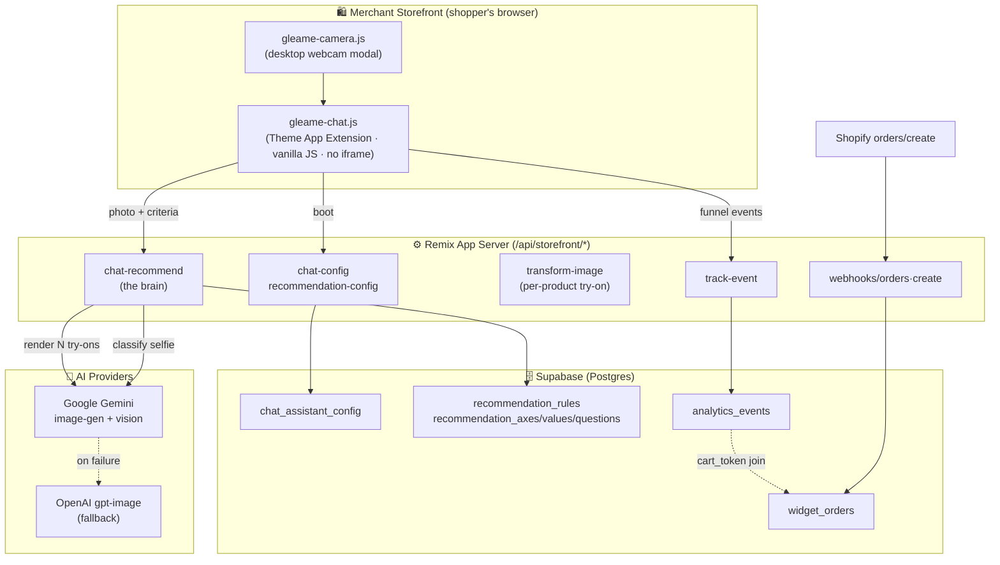
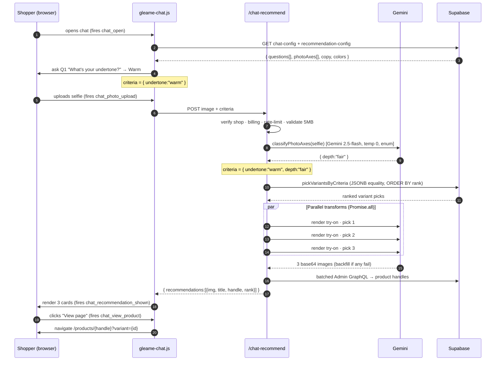
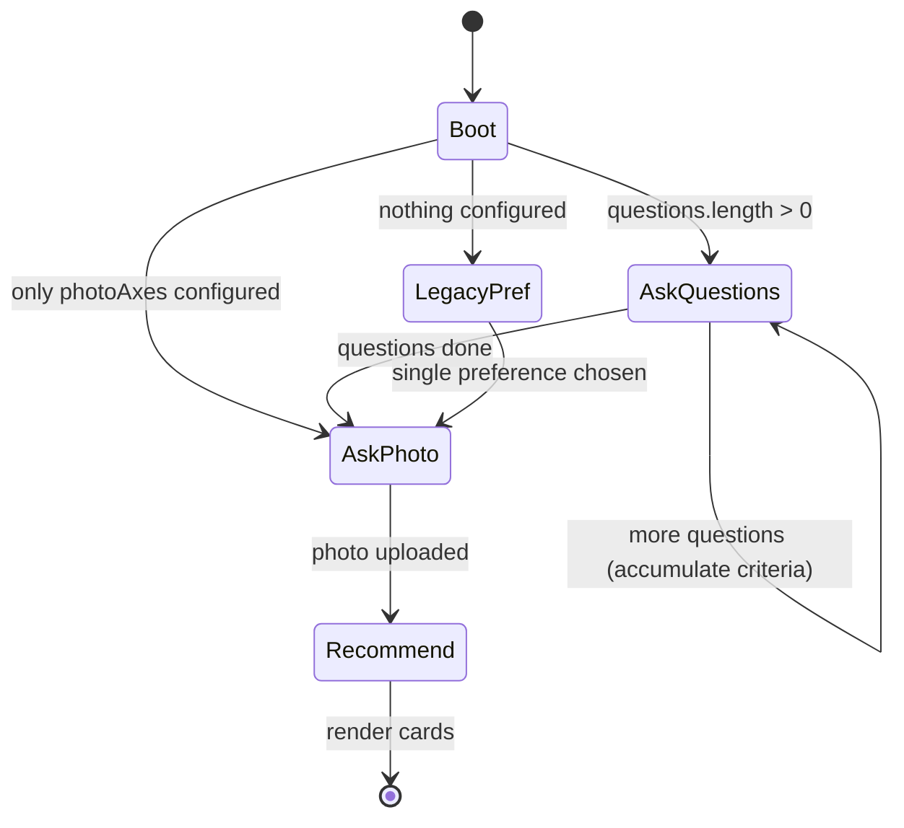
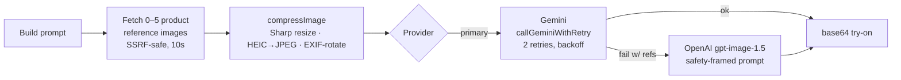
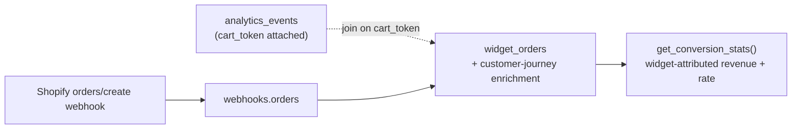

# Gleame — The AI Assistant, Mapped End-to-End

> A complete technical reference for the **chat assistant** subsystem of Gleame, an AI conversion-rate-optimization (CRO) product for Shopify beauty stores. Written as interview-prep + onboarding doc. Everything here is grounded in the actual codebase.

---

## 0. How to read this document

| If you want… | Go to |
|---|---|
| The 60-second pitch | [§1 The one-paragraph version](#1-the-one-paragraph-version) |
| The big picture diagram | [§3 System architecture](#3-system-architecture-the-map) |
| What happens on one shopper request | [§4 The request lifecycle](#4-the-request-lifecycle-one-shoppers-journey) |
| How recommendations are chosen | [§5 The recommendation engine](#5-the-recommendation-engine-cold-start-by-design) |
| How try-on images are made | [§6 The image-generation pipeline](#6-the-image-generation-pipeline) |
| Why each decision was made | [§9 Design decisions & defenses](#9-design-decisions--their-defenses) |
| The hard problems | [§10 The hard problems](#10-the-hard-problems) |
| The real results | [§11 Impact: the honest data story](#11-impact-the-honest-data-story) |
| Tough interview questions | [§13 The question bank](#13-the-question-bank-15-hardest-questions) |

---

## 1. The one-paragraph version

**Gleame is a conversion-optimization system for Shopify beauty stores.** Its centerpiece is a **chat assistant** that asks a shopper two quick questions, reads a selfie, and renders **real AI try-on images of the specific products it recommends for that person** — collapsing *discover → believe → buy* into a single conversation. The AI image generation is the engine, but the actual product is the surrounding system: a cold-start recommendation engine, a deterministic prompt-generation layer, a multi-tenant security/billing/rate-limiting boundary, and a full funnel-analytics + purchase-attribution pipeline. It runs as a **Shopify Theme App Extension** (vanilla JS, no iframe, on the merchant's own domain) backed by a **Remix** server, **Supabase/Postgres**, **Google Gemini** (primary AI), and **OpenAI gpt-image** (fallback).

---

## 2. Motivation — why this exists

Beauty e-commerce has two structural, expensive problems, both rooted in the same gap:

1. **Low conversion.** A shopper cannot tell whether a lipstick shade or foundation suits *their* skin from a flat product photo. Doubt kills the purchase.
2. **High return rates.** When they buy anyway and it's wrong, it comes back — eroding margin and trust.

Existing solutions are weak: AR filters feel gimmicky and don't map to real SKUs; "shade finder" quizzes don't *show* you anything. **Gleame's bet:** a conversational assistant that (a) personalizes via a couple of questions + a selfie, (b) recommends specific in-catalog products, and (c) *shows* the shopper those exact products on their own face. If the shopper *believes* the result, conversion rises and returns fall.

The assistant is the highest-intent surface in the app: a shopper who opens it, answers questions, and uploads a photo has self-selected into deep purchase intent.

---

## 3. System architecture — the map



**Reading the map:** the widget boots from config endpoints, sends the photo+answers to `chat-recommend` (the brain), which classifies the selfie and renders try-ons via Gemini (OpenAI as fallback), then returns cards. Every step emits a funnel event; purchases are reconciled back via the Shopify `orders/create` webhook joined on the cart token.

### 3.1 The tech stack (and why)

| Layer | Choice | Why |
|---|---|---|
| Widget | Theme App Extension, **vanilla JS, no iframe** | Same-origin with the store → direct access to Shopify's AJAX cart, no iframe latency, inherits store trust. Cost: harder CSS isolation. |
| Server | Remix v2 (React 18 + TS) | File-based routes, server loaders/actions, one framework for admin + storefront APIs. |
| App data | Supabase (Postgres) | Managed Postgres, JSONB for the rules matrix, RPC functions for analytics. |
| Sessions | Prisma | **Only** the Shopify OAuth `Session` table. |
| AI (primary) | Google Gemini | Best quality/cost for face-aware image edits in this use case. |
| AI (fallback) | OpenAI gpt-image-1.5 | Reliability — provider diversity against refusals/outages. |
| Image proc | Sharp + heic-convert | Resize/normalize; iOS HEIC support. |
| Billing | Hey Mantle | Shopify subscription tiers. |

---

## 4. The request lifecycle — one shopper's journey



**Perceived experience:** a ~20-second "consultation" with a 3-step loading animation, ending in three personalized try-on cards. **Under the hood:** a security gauntlet, a vision classification, a deterministic DB lookup, N parallel image generations with failure backfill, and a handle-resolution round-trip.

---

## 5. The recommendation engine — cold-start by design

### 5.1 The core insight
A normal recommender learns from behavioral data. **A newly-installed merchant has zero data.** So Gleame inverts the problem: instead of *learning* preferences, it **elicits** them (a couple of questions) and **infers** the rest (from the photo), then maps that to a **merchant-authored rules matrix**. This works at *N = 0 users* and can later be *augmented* with learning once event volume justifies it.

### 5.2 The flow (client state machine)
`gleame-chat.js` runs a small state machine driven by `recommendation-config`:



Each answered question appends to a `criteria` object: `{ undertone: "warm" }`. Questions can carry merchant-written "bot personality" lines between them.

### 5.3 The photo classifier (`classifyPhotoAxes`)
For any axis the *questions* didn't cover (e.g. skin `depth`), the server classifies it **from the selfie**:

- **Model:** `gemini-2.5-flash` used as a **vision classifier** (not image-gen).
- **Output:** structured JSON, **one property per axis, constrained to an enum** of the merchant's allowed values.
- **Determinism:** **temperature 0** → it's a labeler, not a creative generator. It *cannot* return a value the matrix doesn't understand.
- **Robustness:** image downscaled to 768px; 12s timeout; system prompt says *"never refuse — pick the closest match."* On any error → returns `{}` → graceful fallback.

### 5.4 The match (`pickVariantsByCriteria`)
A **strict JSONB-equality lookup** against the merchant-authored matrix:

```sql
SELECT variant_id, product_id, rank
FROM recommendation_rules
WHERE shop_id = $1 AND criteria = $2::jsonb   -- e.g. '{"depth":"fair","undertone":"warm"}'
ORDER BY rank;                                 -- rank 1 = the merchant's top pick
```

- JSONB equality is **order-independent** and exact: a rule matches or it doesn't. **No fuzzy scoring, no ML.**
- Backed by a `UNIQUE (shop_id, criteria, rank)` btree index → a single index hit.
- Rules can target a **specific variant** *or* an entire **product**.

### 5.5 Fallback ordering
If no rule matches (or photo classification returned `{}`), the engine **Fisher-Yates shuffles** the candidate pool and runs a **diversity pass** (one variant per product first, then backfill) so the shopper never sees three near-identical results.

### 5.6 The data model

| Table | Purpose |
|---|---|
| `recommendation_axes` | The dimensions (e.g. `undertone`, `depth`), each tagged `source = 'photo' | 'user_question'`. |
| `recommendation_axis_values` | Allowed values per axis (`fair`, `medium`, `deep`). |
| `recommendation_questions` | One prompt per `user_question` axis. |
| `recommendation_question_options` | The buttons (label → axis value, + optional bot response). |
| `recommendation_rules` | **The lookup table.** `criteria` JSONB → ranked `variant_id`/`product_id`. |
| `product_variants.tagline` | Optional italic card copy ("A warm red with subtle shimmer"). |

> **Defensible one-liner:** *"It's deterministic knowledge engineering, not a learned recommender — the right tool when a merchant has zero behavioral data, and the substrate I'd layer learning onto later."*

---

## 6. The image-generation pipeline

### 6.1 Model tiering (know the why)

| Model | When | Why |
|---|---|---|
| `gemini-3-pro-image-preview` | Products with detailed **variant configs** | Highest fidelity for precise makeup shades. |
| `gemini-2.5-flash-image` | Standard transforms | Fast + cheap for the common case. |
| `gemini-3.1-flash-image-preview` | High-quality (2K input) | More detail retention when needed. |
| `gpt-image-1.5` (OpenAI) | **Fallback** | Reliability net + face-edit refusal handling. |

Model is auto-selected: admin override → else *pro if the product has variant configs, flash otherwise*.

### 6.2 The transform path (per recommendation)



- **Parallelism:** the top N picks are generated **concurrently with `Promise.all`** — wall-clock ≈ one image, not N.
- **Backfill:** if a pick fails to generate, a fallback candidate takes its slot so the shopper always gets a full set of cards.
- **Safety framing (OpenAI path):** the prompt is prefixed with a context preamble ("professional e-commerce virtual try-on tool…") to avoid face-edit refusals.
- **Compression:** inputs downscaled to the model's max px (720 for most, 2048 for 3.1-flash); HEIC→JPEG; EXIF-rotate so iOS photos aren't sideways; progressive JPEG q85.
- **No caching:** every output is a function of *this* shopper's photo + config → cache hit rate ≈ 0. (Caching *classifications*/reference compressions is the more promising future win.)

### 6.3 Prompt generation — deterministic, not LLM-written
Prompts are **concatenated**, not generated by a model:

```
categories.csv ──► category_parameters.csv ──► parameter_levels.csv
                         │                            │
                         ▼                            ▼
              (merchant picks a level)        (level's prompt_text)
                         │                            │
                         └──────────► CONCATENATE ◄───┘
                                          │
                  + variant_color_profiles (shade, hue family, undertone,
                    deep_skin_visibility_strategy)
                  + locked "guardrail" prompts
                                          │
                                          ▼
                              final transform instruction
```

> **Defense:** determinism = reproducibility + merchant control + no prompt-injection surface. The merchant configures *meaning* (levels); the system assembles the *string*.

---

## 7. Security & multi-tenancy

Every storefront request crosses a hardening boundary **before** doing expensive work:

| Control | What it does |
|---|---|
| **Shop-domain verification** | Exact match on `shop_domain`, else `alternate_domains` whitelist. Prevents cross-shop data access and rate-limit bypass via spoofed domains. |
| **Billing gate** | `shopHasValidAccess` — active sub / trial / grace / grandfathered, else `403`. |
| **Tiered rate limiting** | transform-image: **20/min** + **100/hr** per IP, **1000/hr** per shop. The recommend endpoint has its own **10/min per IP**; track-event **100/min**. `Retry-After` with jitter to avoid thundering herd. |
| **Input validation** | MIME + extension sniffing (iOS empty-type uploads), **5 MB cap**. |
| **SSRF-safe fetch** | Merchant-supplied reference-image URLs fetched through a safe-fetch wrapper, 10s timeout. |

> **Scaling caveat to own:** the rate limiter is **in-memory** today — fine for current scale, needs Redis to scale horizontally.

---

## 8. Analytics & attribution — closing the loop

### 8.1 The funnel events
Fired client-side (`trackEvent`) → `/api/storefront/track-event` → `analytics_events`:

`chat_open` · `chat_recommend_start` · `chat_photo_upload` · `chat_recommendation_shown` · `chat_view_product` · `chat_add_bundle_to_bag` · `hero_view` · `hero_cta_click`

These are **shop-level** (not tied to a product), which is why **migration 040** made `analytics_events.product_id` nullable and added a `(shop_id, event_type, created_at)` composite index to serve the funnel counts.

### 8.2 The engagement query
`getAssistantEngagement(shop, daysBack=7)` runs eight parallel `COUNT`s over the window. (There are *nine* allowed assistant events; `hero_dismiss` is accepted/emitted but not counted — so the engagement query covers 8 of 9.) **Caveat baked into the code:** counts are **event volume, not unique sessions** — no session ID yet, so a double-upload double-counts. Fine for *relative* funnel health; a session ID is the fix for *absolute* rates.

### 8.3 Purchase attribution


The **cart token** is the only reliable session↔order join on Shopify. The `orders/create` webhook records the order, enriches it with Shopify's customer-journey summary (first/last touch, UTM, days-to-conversion), and a Postgres RPC computes widget-attributed conversion and revenue.

### 8.4 The A/B test — be precise
The "Gleame Test" experiment (variant vs. original) is **Shopify-native** (run in Shopify's admin), **not** built into this codebase. **Say this plainly** — don't claim you built A/B infrastructure. You built the *product* and the *funnel instrumentation*; Shopify ran the controlled experiment that measured lift.

---

## 9. Design decisions & their defenses

| Decision | Defense (the "because") |
|---|---|
| No iframe, vanilla JS on-domain | Same-origin cart access + speed + trust; accept harder CSS isolation. |
| Deterministic rules matrix (not ML) | Cold-start: nothing to learn from at N=0; predictable, debuggable, merchant-controlled; single indexed lookup. |
| Gemini primary, OpenAI fallback | Single-provider face-editing is fragile (refusals/outages); provider diversity is reliability engineering. |
| Vision classifier at temp 0, enum-locked | I want a *labeler*, not creativity; can't emit a value the matrix won't understand; degrades to `{}`. |
| Parallel transforms + backfill | Latency is the enemy; parallel ≈ 1× not N×; backfill guarantees a full card set. |
| Concatenated prompts, not LLM-written | Reproducibility + merchant control + no injection surface. |
| Fire-and-forget analytics, cart-token attribution | Tracking must never slow/break the shopper path; real attribution reconciled server-side. |

---

## 10. The hard problems

### 10.1 The latency / cost / quality triangle
Generating N personalized try-on images per session is **slow, expensive, and quality-variable simultaneously.** Nearly every architectural choice is a response:

- **Latency** → parallelize N transforms; downscale inputs (past ~720px the model barely benefits but you pay upload+inference); cap retries; mask the wait with a purposeful "consultation" UI.
- **Cost** → model tiering (flash by default, pro only where precision pays); generate **only** what you'll show; rate limits as a cost circuit-breaker.
- **Quality** → reference-image conditioning (real product photos, not hallucinated shades); deep-skin visibility strategy; pro model for makeup precision.
- **The tension to name out loud:** even optimized, it's a **~20s wait, mostly on mobile, before value appears** — which is *exactly* the funnel leak (§11).

### 10.2 Cold-start recommendation (covered in §5.1)
Elicit + infer instead of learn. Works at N=0; upgradeable later.

### 10.3 The smaller-but-real ones
HEIC/EXIF normalization (iOS photos arrive sideways and in unsupported formats) · face-edit refusals (safety framing + provider fallback) · SSRF on merchant-supplied URLs · multi-tenant isolation · abuse of an expensive endpoint.

---

## 11. Impact — the honest data story

> This is your strongest material: most candidates have no production data. Use it with rigor — *build → measure → diagnose → iterate*.

### 11.1 The funnel (last 7 days)

```
Assistant opened       ████████████████████████  245
Consultation started   ███████████████████████   235   (96%)
Photo uploaded         ████████                    79   (34%)  ◄── 66% LEAK
Recommendations shown  ████████                    78   (99%)
Product clicked        ████                         38   (49%)
```

**Diagnosis:** the funnel is healthy *everywhere except the photo step*. Everything downstream of "got a photo" converts beautifully (99%, 49%). **The entire business is gated on one step: getting a shopper to take/upload a photo on mobile.**

### 11.2 The A/B test (Shopify-native)

| Segment | Conversion | AOV | Rev / visitor |
|---|---|---|---|
| **Blended** | ▼ ~3.0% vs 3.7% | ▲ **+7.5%** | ▼ |
| **Desktop** | ▲ up | ▲ up | ▲ up (big) |
| **Mobile** (most traffic) | ▼ down | ~flat | ▼ down |

**The synthesis (memorize):**
> *"On desktop, where the photo step is frictionless, the try-on lifts conversion **and** basket size — the concept is validated. On mobile, photo-capture friction costs me marginal converters faster than the try-on wins them back, and since mobile is most of the traffic, the blend goes negative. The fix isn't the AI — the AI works. It's mobile photo friction, which my own funnel independently confirms is the 66% leak."*

**The caveat you volunteer:** sample is small (~60–74 conversions/arm) → **directional, not yet significant**. Let it run; don't crown or kill on this.

### 11.3 Why this story wins the room
It proves you (1) instrument what you build, (2) read conflicting signals (AOV up, conversion down) without spin, (3) triangulate two independent data sources to one root cause, and (4) know the next move is **product** (reduce mobile friction), not more AI. That's founder behavior.

---

## 12. What I'd build next (roadmap)

1. **Kill the mobile photo friction** — stream a hero try-on first (1 image fast) then backfill the rest; tighten the camera UX; clearer framing copy (the configurable hint is step one).
2. **Session IDs** → honest unique-user funnels and true per-session conversion.
3. **Layer learning on the matrix** — once event volume justifies it, re-rank merchant rules by observed click/convert.
4. **Measure returns** — the second-order value thesis (accuracy → fewer returns) is currently unmeasured.
5. **Scale-out infra** — Redis rate limiter, a transform queue with streamed results, per-shop quota dashboards.
6. **Caching** — classifications and reference-image compressions (not the final outputs).

---

## 13. The question bank — 15 hardest questions

1. **"Is this just a Gemini wrapper?"** → The model is one component; the product is the funnel, cold-start recommender, security/billing/rate-limit boundary, prompt-gen, and attribution. "The model is the engine; I built the car."
2. **"Why a rules matrix and not ML?"** → Cold-start (§5.1). Right tool at N=0; substrate for learning later.
3. **"How do you know the try-ons are accurate?"** → Reference-image conditioning + per-variant color profiles + deep-skin strategy + pro model for precision. Accuracy is also the returns thesis.
4. **"20s is forever in e-comm. Defend it."** → Agreed — it's my funnel leak. Parallelism + consultation UI + downscaling now; stream-a-hero-first next.
5. **"Your A/B is negative. Why isn't this dead?"** → Device-split synthesis (§11.2): desktop validates concept; mobile is fixable friction.
6. **"Cost per session? Do unit economics work?"** → Formula: **N=3 images × per-image cost + 1 classification** (verified N). Pricing isn't in the codebase, so I quote the rate-card number I measured beforehand — never improvise it. The tension is real: **flat subscription tiers ($0/$30/$149/$399) vs. per-session variable AI cost** — which is exactly why model tiering and "only render what you show" are margin decisions, not just latency ones.
7. **"How do you prevent abuse of an expensive endpoint?"** → 3-tier rate limit + billing gate + shop verification + 5 MB cap + SSRF-safe fetch.
8. **"Multi-tenant isolation?"** → Shop-domain verification (exact/alternate whitelist) on every call; everything scoped by `shop_id`.
9. **"Gemini down or refuses a face edit?"** → Retry+backoff → OpenAI safety-framed fallback → backfill → graceful degrade. No single point of failure.
10. **"Why no caching of transforms?"** → Output is a function of this shopper's photo+config → ~0 hit rate. Cache classifications/compressions instead.
11. **"How is purchase attributed?"** → Cart token threaded through events, reconciled in `orders/create` webhook → `widget_orders`, joined via `get_conversion_stats()`.
12. **"Events not sessions — isn't the funnel inflated?"** → Correct, and I flag it in code. Fine for relative health; session ID fixes absolute rates.
13. **"How do merchants configure all this?"** → Admin app writes Supabase; storefront reads cached config endpoints. Funnel/matrix/prompt/copy all merchant-editable.
14. **"What breaks at 100×?"** → In-memory rate limiter (→Redis), synchronous transform fan-out (→queue+streaming), per-shop Gemini quota, Supabase connections.
15. **"What would you do differently?"** → Instrument mobile-vs-desktop + per-step latency from day one (I'd have caught the photo leak weeks earlier); ship session IDs.

---

## 14. Own these weaknesses (before he finds them)

- Mobile conversion is currently net-negative — known, diagnosed, fixable.
- The recommender is deterministic, not learned — deliberate for cold-start.
- Prompts are concatenated, not generated — deliberate for control/reproducibility.
- Analytics count events, not unique sessions — no session ID yet.
- Rate limiter is in-memory — needs Redis to scale.
- A/B sample is small — directional only.
- Cost-per-session must be *measured*, not estimated, before the room.

---

## 15. Anchor sentences (say these verbatim)

- **What it is:** *"Gleame is a conversion-optimization system for Shopify beauty stores: a chat assistant that asks two questions, reads a selfie, and renders real AI try-on images of the specific products it recommends — collapsing discover-believe-buy into one conversation."*
- **Hardest problem:** *"Generating personalized try-on images per session is slow, expensive, and quality-variable all at once — nearly every architectural decision is a response to that triangle."*
- **Cold-start:** *"You can't learn preferences from zero users, so I elicit them with two questions and infer the rest from the photo, then map to merchant-authored rules — knowledge engineering that works at N=0 and gets replaced by learning later."*
- **Impact, honest:** *"My A/B test is blended-negative — but split by device, desktop wins and mobile loses, and my own funnel shows why: a 66% drop at the mobile photo step. The AI works; the mobile friction is the bug. That's a product fix, not a model fix."*

---

## Appendix A — Key files

| File | Role |
|---|---|
| `extensions/glimpse-widget/assets/gleame-chat.js` | The chat widget: state machine, upload, render (~2k LOC). |
| `extensions/glimpse-widget/assets/gleame-camera.js` | Desktop webcam modal. |
| `app/routes/api.storefront.chat-config.ts` | Merchant UI/copy config. |
| `app/routes/api.storefront.recommendation-config.ts` | Questions + photo axes flow metadata. |
| `app/routes/api.storefront.chat-recommend.ts` | **The brain:** classify → match → transform → backfill. |
| `app/routes/api.storefront.transform-image.ts` | Per-product try-on endpoint (security, rate limit). |
| `app/routes/api.storefront.track-event.ts` | Funnel event ingest. |
| `app/routes/webhooks.orders.tsx` | `orders/create` → attribution. |
| `app/lib/ai.server.ts` | Gemini/OpenAI calls, retries, compression. |
| `app/lib/photo-axis-classifier.server.ts` | Selfie → axes (Gemini 2.5-flash, enum, temp 0). |
| `app/lib/prompt-generator.server.ts` | Funnel-based prompt concatenation. |
| `app/lib/supabase.server.ts` | `pickVariantsByCriteria`, `getAssistantEngagement`, `recordOrder`, config. |
| `app/lib/rate-limiter.server.ts` | In-memory sliding-window limiter. |

## Appendix B — Verified constants & the cost rule

> All technical numbers in this doc were extracted from code and **adversarially re-verified (57/57 confirmed, 0 corrections)**. The full table lives in `VERIFIED_FACTS.md`. The essentials: **N = 3** recommendations (configurable 1–5); Gemini **2** retries / OpenAI **1** retry @ **120 s**; **5** max reference images; **720/2048** px; **5 MB** cap; classifier **temp 0 / 768 px / 12 s**.

**The cost rule (read before the room):** per-image / per-token AI pricing is **NOT in the codebase** — there is no $/image, $/session, or token-budget constant anywhere. **Do not state a dollar cost live; that would be fabrication.** State the *formula* instead:

```
cost_per_session = N × per_image_gen_cost + 1 × classification_cost   (N = 3 verified)
```

…then fill the two unit costs from the **provider's current rate card** beforehand and simply multiply.

### Monetization (an e-commerce founder will ask)
Session-based subscription tiers (via Hey Mantle): **Free $0 · Starter $30 · Launch $149 · Growth $399**. The strong point to volunteer: **flat subscription revenue vs. per-session variable AI cost** is exactly *why* model tiering, "only render what you show," and rate limits are **margin decisions**, not just performance ones.

### Still to measure yourself (not in code)
- **End-to-end latency**, mobile vs desktop.
- **Current A/B sample size + significance** at interview time.
- **Per-image AI cost** from the provider rate card → then compute the formula above.
